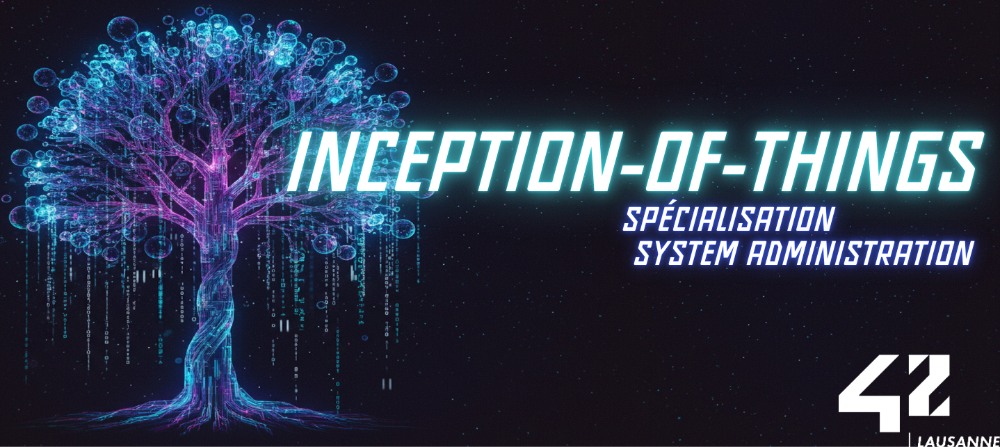
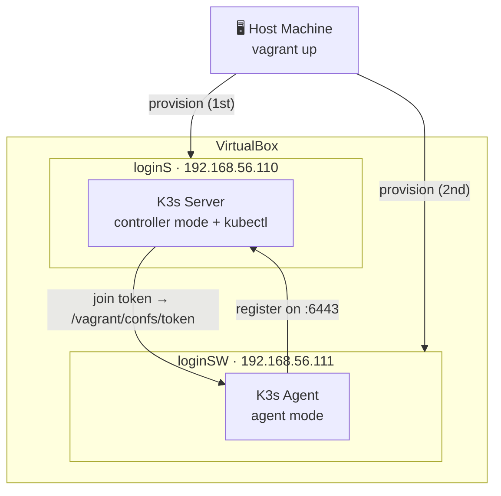
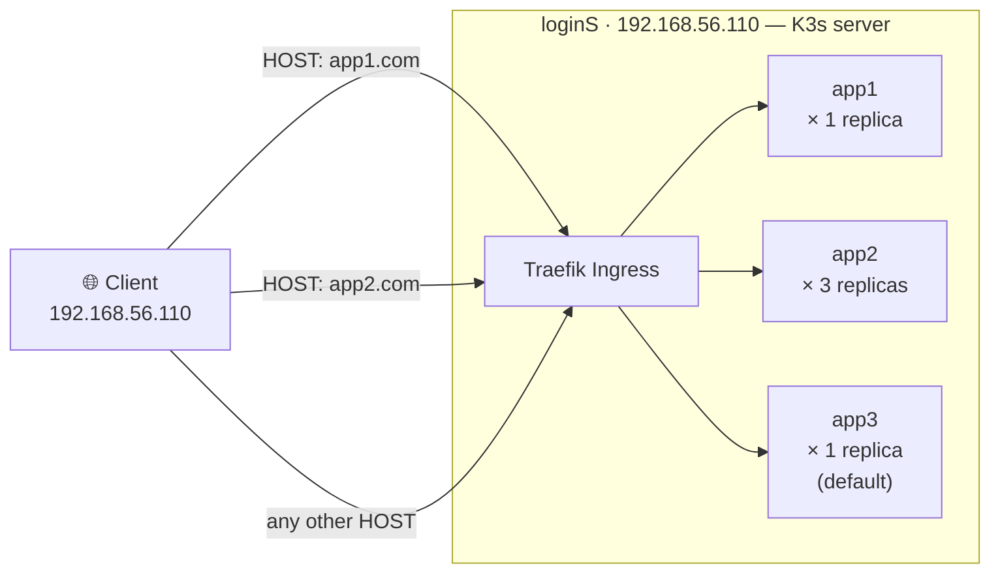
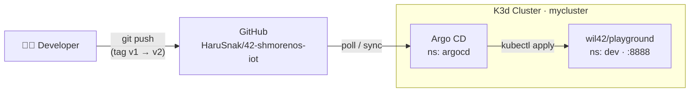
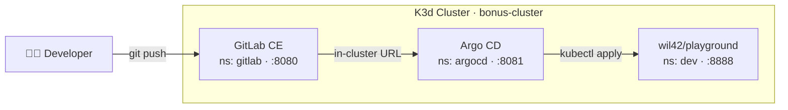
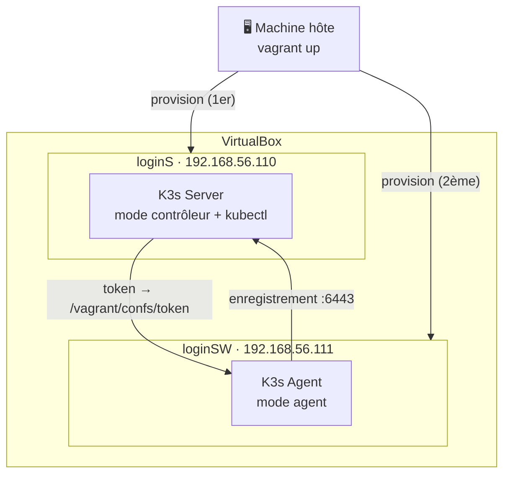
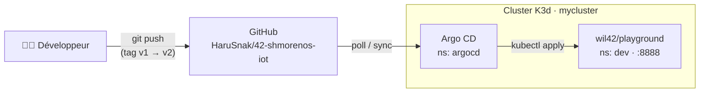
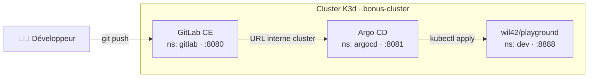

<div align="center">

# Inception-of-Things (IoT)
### Automated introduction to Kubernetes orchestration and GitOps.

[![Contributors][contributors-shield]][contributors-url]
[![Forks][forks-shield]][forks-url]
[![Stargazers][stars-shield]][stars-url]
[![Issues][issues-shield]][issues-url]
[![License][license-shield]][license-url]
[![LinkedIn][linkedin-shield]][linkedin-url]

</div>

---

## 🇬🇧 English

<details>
<summary><b>📖 Click to expand/collapse English version</b></summary>

### 📋 Table of Contents

- [About](#about)
- [Skills Learned](#skills-learned)
- [Approach](#approach)
- [Project Structure](#project-structure)
- [Installation](#installation)
- [Usage](#usage)
- [Credits](#credits)

---

<a name="about"></a>

### 📖 About

This project is a minimal introduction to Kubernetes. It aims to deepen your knowledge by making you use K3d and K3s with Vagrant. You will learn how to set up personal virtual machines, use K3s and its Ingress controller, and discover K3d. The final step introduces GitOps with Argo CD and a local GitLab instance.

---

<a name="skills-learned"></a>

### 🧠 Skills Learned

- Provisioning virtual machines with Vagrant and VirtualBox.
- Installing and configuring K3s in controller and agent modes.
- Deploying web applications on Kubernetes with Deployments and Services.
- Routing traffic based on the `HOST` header using a Kubernetes Ingress.
- Creating a K3d cluster and managing it with kubectl.
- Setting up a local GitLab CE instance via Helm.
- Configuring Argo CD for automated GitOps continuous deployment.

---

<a name="approach"></a>

### 🗺️ Approach

The project is divided into three mandatory parts and one bonus:

**Part 1 — K3s and Vagrant**: Two VMs are provisioned — a K3s server (controller) at `192.168.56.110` and a K3s agent (worker) at `192.168.56.111`. The join token is shared between VMs via Vagrant's synced folder.



**Part 2 — K3s and three applications**: A single K3s server hosts three web apps. Traffic is routed by `HOST` header via Traefik Ingress: `app1.com` → app1, `app2.com` → app2, anything else → app3 (default catch-all). App2 runs with 3 replicas.



**Part 3 — K3d and Argo CD**: A K3d cluster replaces Vagrant. Argo CD watches a public GitHub repository and automatically deploys the application in the `dev` namespace. Changing the image tag in the repo triggers a live update.



**Bonus — GitLab + Argo CD**: Everything from Part 3 is replicated using a local GitLab CE instance (Helm) instead of GitHub. Argo CD syncs from the in-cluster GitLab service.



---

<a name="project-structure"></a>

### 📂 Project Structure

```
42-Inception-of-Things/
├── p1/
│   ├── Vagrantfile                  # 2 VMs: loginS (controller) + loginSW (agent)
│   ├── scripts/
│   │   ├── server_setup.sh          # Installs K3s server, shares join token
│   │   └── worker_setup.sh          # Waits for token, joins cluster as agent
│   └── confs/                       # Populated at runtime (join token)
├── p2/
│   ├── Vagrantfile                  # 1 VM: loginS (K3s server)
│   ├── scripts/
│   │   └── setup.sh                 # Installs K3s, deploys all manifests
│   └── confs/
│       ├── app1.yml                 # Deployment + Service for app1 (1 replica)
│       ├── app2.yml                 # Deployment + Service for app2 (3 replicas)
│       ├── app3.yml                 # Deployment + Service for app3 (1 replica)
│       └── ingress.yml              # Traefik Ingress: HOST-based routing
├── p3/
│   ├── scripts/
│   │   └── setup.sh                 # Installs Docker, K3d, kubectl, Argo CD
│   └── confs/                       # Manifests live in GitHub repo (GitOps)
├── bonus/
│   ├── scripts/
│   │   └── setup.sh                 # Installs K3d, GitLab CE (Helm), Argo CD
│   └── confs/
│       ├── deployment.yml           # wil42/playground:v1 in dev namespace
│       ├── service.yml              # ClusterIP service on port 8888
│       └── ingress.yml              # Traefik Ingress for the playground app
└── README.md
```

---

<a name="installation"></a>

### 🚀 Installation

**Prerequisites**

| Part | Required tools |
|------|---------------|
| p1, p2 | [Vagrant](https://developer.hashicorp.com/vagrant/install) + [VirtualBox](https://www.virtualbox.org/wiki/Downloads) |
| p3, bonus | [Docker](https://docs.docker.com/engine/install/) + [K3d](https://k3d.io/#installation) + [kubectl](https://kubernetes.io/docs/tasks/tools/) + [Helm](https://helm.sh/docs/intro/install/) (bonus only) |

```bash
git clone https://github.com/HaruSnak/42-shmorenos-iot.git
cd 42-shmorenos-iot
```

---

<a name="usage"></a>

### 💻 Usage

**Part 1 — K3s cluster with Vagrant**
```bash
cd p1
vagrant up          # Provisions both VMs sequentially (server then worker)
vagrant ssh loginS  # Connect to the server
kubectl get nodes   # Verify both nodes are Ready
```

**Part 2 — Three applications with Ingress**
```bash
cd p2
vagrant up
vagrant ssh loginS
# Test routing by HOST header:
curl -H "Host: app1.com" http://192.168.56.110   # → app1
curl -H "Host: app2.com" http://192.168.56.110   # → app2
curl http://192.168.56.110                        # → app3 (default)
```

**Part 3 — K3d cluster with Argo CD**
```bash
cd p3
bash scripts/setup.sh
# Access the Argo CD UI (in a separate terminal):
kubectl port-forward svc/argocd-server -n argocd 8081:443
# Credentials are printed by the script.
# Test the deployed app:
curl http://localhost:8888/
# To trigger a version change, update the image tag in the GitHub repo:
# sed -i 's/playground:v1/playground:v2/' deployment.yaml && git add . && git commit -m "v2" && git push
```

**Bonus — GitLab + Argo CD**
```bash
cd bonus
bash scripts/setup.sh
# Access URLs are printed at the end of the script.
# 1. Create project 'iot-project' as PUBLIC on GitLab.
# 2. Push the YAML manifests from bonus/confs/ into a 'confs/' folder in that project.
# Argo CD will auto-sync and deploy into the dev namespace.
```

---

<a name="credits"></a>

### 📖 Credits

- **Kubernetes documentation**: [kubernetes.io](https://kubernetes.io/docs/concepts/)
- **Vagrant documentation**: [developer.hashicorp.com](https://developer.hashicorp.com/vagrant/docs/vagrantfile)
- **K3d documentation**: [k3d.io](https://k3d.io/stable/)
- **Argo CD documentation**: [argo-cd.readthedocs.io](https://argo-cd.readthedocs.io/en/stable/)
- **GitLab Helm chart**: [docs.gitlab.com](https://docs.gitlab.com/charts/)
- **Wil's playground app**: [hub.docker.com/r/wil42/playground](https://hub.docker.com/r/wil42/playground)

### 📄 License

This project is licensed under the **MIT License** — see the [LICENSE](LICENSE) file for details.

</details>

---

## 🇫🇷 Français

<details>
<summary><b>📖 Cliquez pour développer/réduire la version française</b></summary>

### 📋 Table des matières

- [À propos](#à-propos)
- [Compétences acquises](#compétences-acquises)
- [Approche](#approche)
- [Structure du projet](#structure-du-projet)
- [Installation](#installation-fr)
- [Utilisation](#utilisation)
- [Crédits](#crédits)

---

<a name="à-propos"></a>

### 📖 À propos

Ce projet est une introduction minimale à Kubernetes. Il vise à approfondir vos connaissances en utilisant K3d et K3s avec Vagrant. Vous apprendrez à configurer des machines virtuelles, à utiliser K3s et son contrôleur Ingress, puis à découvrir K3d. La dernière étape introduit le GitOps avec Argo CD et une instance GitLab locale.

---

<a name="compétences-acquises"></a>

### 🧠 Compétences acquises

- Provisionnement de machines virtuelles avec Vagrant et VirtualBox.
- Installation et configuration de K3s en modes contrôleur et agent.
- Déploiement d'applications web sur Kubernetes via Deployments et Services.
- Routage du trafic par l'en-tête `HOST` grâce à un Ingress Kubernetes.
- Création d'un cluster K3d et gestion avec kubectl.
- Déploiement de GitLab CE en local via Helm.
- Configuration d'Argo CD pour un déploiement continu automatisé (GitOps).

---

<a name="approche"></a>

### 🗺️ Approche

Le projet se divise en trois parties obligatoires et un bonus :

**Partie 1 — K3s et Vagrant** : Deux VMs sont provisionnées — un serveur K3s (contrôleur) à `192.168.56.110` et un agent K3s (worker) à `192.168.56.111`. Le token de jonction est partagé entre les VMs via le dossier synchronisé de Vagrant.



**Partie 2 — K3s et trois applications** : Un seul serveur K3s héberge trois applications web. Le trafic est routé par l'en-tête `HOST` via l'Ingress Traefik : `app1.com` → app1, `app2.com` → app2, tout autre HOST → app3 (catch-all par défaut). App2 tourne avec 3 réplicas.


**Partie 3 — K3d et Argo CD** : Un cluster K3d remplace Vagrant. Argo CD surveille un dépôt GitHub public et déploie automatiquement l'application dans le namespace `dev`. Modifier le tag d'image dans le dépôt déclenche une mise à jour en direct.



**Bonus — GitLab + Argo CD** : Tout ce qui a été fait en Partie 3 est reproduit avec une instance GitLab CE locale (Helm) à la place de GitHub. Argo CD synchronise depuis le service GitLab interne au cluster.



---

<a name="structure-du-projet"></a>

### 📂 Structure du projet

```
42-Inception-of-Things/
├── p1/
│   ├── Vagrantfile                  # 2 VMs : loginS (contrôleur) + loginSW (agent)
│   ├── scripts/
│   │   ├── server_setup.sh          # Installe K3s serveur, partage le token de jonction
│   │   └── worker_setup.sh          # Attend le token, rejoint le cluster en agent
│   └── confs/                       # Rempli à l'exécution (token de jonction)
├── p2/
│   ├── Vagrantfile                  # 1 VM : loginS (serveur K3s)
│   ├── scripts/
│   │   └── setup.sh                 # Installe K3s, déploie tous les manifests
│   └── confs/
│       ├── app1.yml                 # Deployment + Service app1 (1 réplica)
│       ├── app2.yml                 # Deployment + Service app2 (3 réplicas)
│       ├── app3.yml                 # Deployment + Service app3 (1 réplica)
│       └── ingress.yml              # Ingress Traefik : routage par HOST
├── p3/
│   ├── scripts/
│   │   └── setup.sh                 # Installe Docker, K3d, kubectl, Argo CD
│   └── confs/                       # Manifests hébergés sur GitHub (GitOps)
├── bonus/
│   ├── scripts/
│   │   └── setup.sh                 # Installe K3d, GitLab CE (Helm), Argo CD
│   └── confs/
│       ├── deployment.yml           # wil42/playground:v1 dans le namespace dev
│       ├── service.yml              # Service ClusterIP sur le port 8888
│       └── ingress.yml              # Ingress Traefik pour l'application playground
└── README.md
```

---

<a name="installation-fr"></a>

### 🚀 Installation

**Prérequis**

| Partie | Outils nécessaires |
|--------|--------------------|
| p1, p2 | [Vagrant](https://developer.hashicorp.com/vagrant/install) + [VirtualBox](https://www.virtualbox.org/wiki/Downloads) |
| p3, bonus | [Docker](https://docs.docker.com/engine/install/) + [K3d](https://k3d.io/#installation) + [kubectl](https://kubernetes.io/docs/tasks/tools/) + [Helm](https://helm.sh/docs/intro/install/) (bonus uniquement) |

```bash
git clone https://github.com/HaruSnak/42-shmorenos-iot.git
cd 42-shmorenos-iot
```

---

<a name="utilisation"></a>

### 💻 Utilisation

**Partie 1 — Cluster K3s avec Vagrant**
```bash
cd p1
vagrant up            # Provisionne les deux VMs séquentiellement (server puis worker)
vagrant ssh loginS    # Connexion au serveur
kubectl get nodes     # Vérifier que les deux nœuds sont Ready
```

**Partie 2 — Trois applications avec Ingress**
```bash
cd p2
vagrant up
vagrant ssh loginS
# Test du routage par en-tête HOST :
curl -H "Host: app1.com" http://192.168.56.110   # → app1
curl -H "Host: app2.com" http://192.168.56.110   # → app2
curl http://192.168.56.110                        # → app3 (défaut)
```

**Partie 3 — Cluster K3d avec Argo CD**
```bash
cd p3
bash scripts/setup.sh
# Accès à l'interface Argo CD (dans un terminal séparé) :
kubectl port-forward svc/argocd-server -n argocd 8081:443
# Les identifiants sont affichés par le script.
# Test de l'application déployée :
curl http://localhost:8888/
# Pour déclencher un changement de version, modifier le tag dans le dépôt GitHub :
# sed -i 's/playground:v1/playground:v2/' deployment.yaml && git add . && git commit -m "v2" && git push
```

**Bonus — GitLab + Argo CD**
```bash
cd bonus
bash scripts/setup.sh
# Les URLs d'accès sont affichées à la fin du script.
# 1. Créer le projet 'iot-project' en PUBLIC sur GitLab.
# 2. Pousser les manifests YAML de bonus/confs/ dans un dossier 'confs/' de ce projet.
# Argo CD synchronisera automatiquement et déploiera dans le namespace dev.
```

---

<a name="crédits"></a>

### 📖 Crédits

- **Documentation Kubernetes** : [kubernetes.io](https://kubernetes.io/docs/concepts/)
- **Documentation Vagrant** : [developer.hashicorp.com](https://developer.hashicorp.com/vagrant/docs/vagrantfile)
- **Documentation K3d** : [k3d.io](https://k3d.io/stable/)
- **Documentation Argo CD** : [argo-cd.readthedocs.io](https://argo-cd.readthedocs.io/en/stable/)
- **Chart Helm GitLab** : [docs.gitlab.com](https://docs.gitlab.com/charts/)
- **Application playground de Wil** : [hub.docker.com/r/wil42/playground](https://hub.docker.com/r/wil42/playground)

### 📄 Licence

Ce projet est sous licence **MIT** — voir le fichier [LICENSE](LICENSE) pour plus de détails.

</details>

---

[contributors-shield]: https://img.shields.io/github/contributors/HaruSnak/42-shmorenos-iot.svg?style=for-the-badge
[contributors-url]: https://github.com/HaruSnak/42-shmorenos-iot/graphs/contributors
[forks-shield]: https://img.shields.io/github/forks/HaruSnak/42-shmorenos-iot.svg?style=for-the-badge
[forks-url]: https://github.com/HaruSnak/42-shmorenos-iot/network/members
[stars-shield]: https://img.shields.io/github/stars/HaruSnak/42-shmorenos-iot.svg?style=for-the-badge
[stars-url]: https://github.com/HaruSnak/42-shmorenos-iot/stargazers
[issues-shield]: https://img.shields.io/github/issues/HaruSnak/42-shmorenos-iot.svg?style=for-the-badge
[issues-url]: https://github.com/HaruSnak/42-shmorenos-iot/issues
[linkedin-shield]: https://img.shields.io/badge/-LinkedIn-black.svg?style=for-the-badge&logo=linkedin&colorB=555
[linkedin-url]: https://www.linkedin.com/in/shany-moreno-5a863b2aa
[license-shield]: https://img.shields.io/github/license/HaruSnak/42-shmorenos-iot.svg?style=for-the-badge
[license-url]: https://github.com/HaruSnak/42-shmorenos-iot/blob/master/LICENSE
